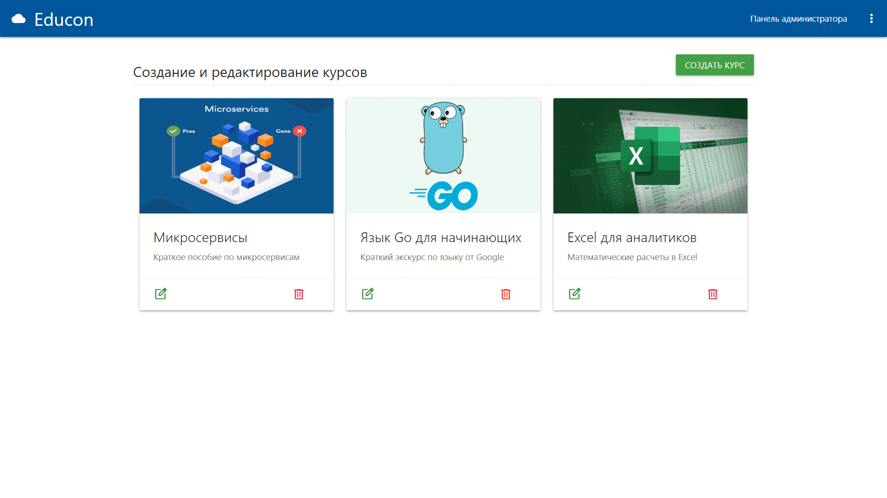

# Educon


# About
Goal of the project is to develop a LMS for employee education.

There are two roles in the system - **administrator** and **employee**.

Main functionality:

**Administrator:**
 - Creation of education courses
 - Filling courses with content
 - Distribution of courses by users
 - Tracking user education progress

**Employee:**
 - Opportunity to take a course
 - Tracking completed courses


# Requirements
- Python = **3.8.0**

# Setup
Clone this repo and cd in it
```
git clone git@github.com:temsolv/educon.git
```

Create virtual environment
```
make venv
```

Activate it and install necessary packages
```
source venv/bin/activate
pip install -r requirements.txt
```

Do migrations
```
python manage.py makemigrations
python manage.py migrate
```

Run background tasks and local server
```
python manage.py runserver
python manage.py process_tasks
```
